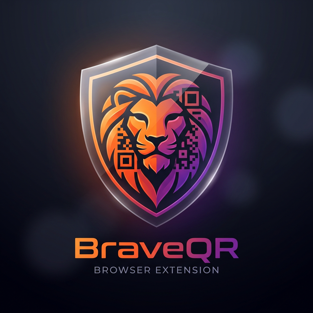

<div align="center">



# BraveQR Scanner

**A blazing-fast QR code scanner built for the Brave browser ecosystem**

[](LICENSE)
[](https://developer.chrome.com/docs/extensions/mv3/intro/)
[](https://brave.com)
[](CONTRIBUTING.md)

---

*Privacy-first · Local scanning · Zero data leakage*

</div>

---

## ✨ Features

| Feature | Description |
|---|---|
| 🔍 **Full Page Deep Scan** | Scans every `` and `<canvas>` element on the active tab |
| 📋 **Multi-Result Support** | Identifies and lists all unique QR codes found simultaneously |
| ⚡ **Native + Fallback Detection** | High-speed `BarcodeDetector` API with a robust `jsQR` fallback |
| 🔒 **Privacy First** | All scanning happens locally — no data ever leaves your machine |
| 🎨 **Clean UI** | Minimalist, glassmorphism-inspired design native to Brave |
| 📎 **Instant Copy** | One-click to copy any detected result to your clipboard |

---

## 🛠️ Tech Stack

<div align="center">


</div>

| Technology | Role |
|---|---|
| **Manifest V3** | Latest Google/Brave extension standard for security & performance |
| **BarcodeDetector API** | Native browser hardware-accelerated QR scanning |
| **jsQR** | Pure JavaScript fallback for maximum compatibility |
| **Vanilla CSS** | Premium glassmorphism UI — no heavy frameworks needed |

---

## 🚀 Installation

### Developer Install (Unpacked)

BraveQR is currently in open-source development. To install manually:

**1. Clone the repository**
```bash
git clone https://github.com/coderanik/BraveQR.git
cd BraveQR
```

**2. Open Brave Extensions**
```
brave://extensions
```

**3. Enable Developer Mode**
> Toggle the switch in the top-right corner of the extensions page.

**4. Load the extension**
> Click **Load unpacked** → select the `BraveQR` folder.

---

## 📖 Usage

```
1.  Navigate to any webpage containing QR codes
2.  Click the BraveQR icon in your extension toolbar
3.  Hit the  Scan Page for QR Codes  button
4.  Detected codes appear in a list — click any to copy it
```

---

## 🤝 Contributing

Contributions are welcome and appreciated! Please read [CONTRIBUTING.md](CONTRIBUTING.md) to get started.

```bash
# Fork → Clone → Branch → Commit → Pull Request
git checkout -b feature/your-feature-name
```

---

## 📜 Code of Conduct

Help us keep this a positive community. Please read our [CODE_OF_CONDUCT.md](CODE_OF_CONDUCT.md).

---

## ⚖️ License

Released under the [MIT License](LICENSE) — free to use, modify, and distribute.

---

<div align="center">

Made with ❤️ for the Brave community

[](https://github.com/coderanik/BraveQR)
[](https://github.com/coderanik/BraveQR/fork)

</div>